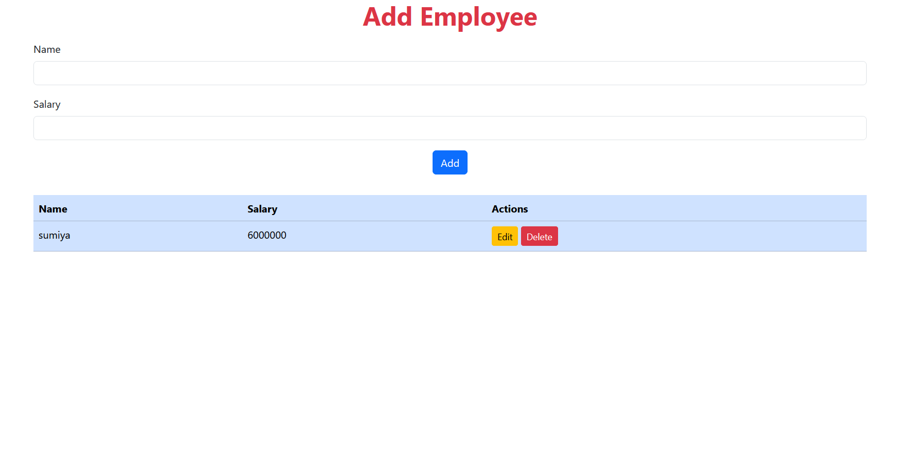
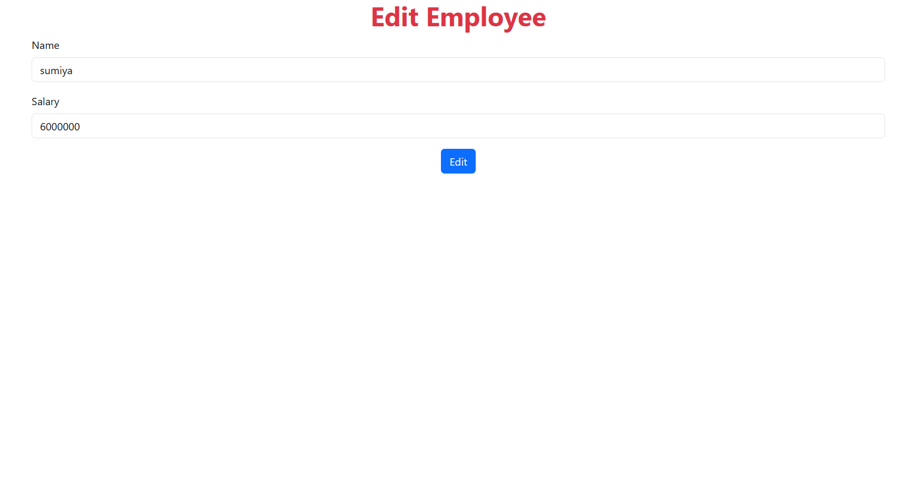
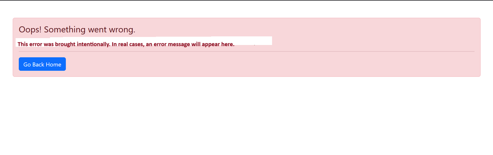

# Employee Management System

A simple CRUD application using **Node.js**, **Express**, **EJS**, and **MongoDB (Local)** for managing employee records.

---

## 📌 Features

- Add new employee
- View all employees
- Edit employee details
- Delete employee record
- Error handling for empty input

---

## 🛠 Tech Stack

- **Backend:** Node.js, Express.js
- **Frontend:** EJS, Bootstrap 5
- **Database:** MongoDB (Local)
- **ODM:** Mongoose

---

## 📂 Project Structure
Employee-Management/
├── controller/
│ └── empController.js
├── model/
│ └── empModel.js
├── routes/
│ └── empRoute.js
├── views/
│ ├── index.ejs
│ └── edit.ejs
├── app.js
├── package.json
├── .gitignore
└── README.md

---

## 📸 Screenshots

   ## 📸 Screenshots

### 🔹 Home Page

### 🔹 Edit Employee Form

### 🔹 Error Page

## 🙋‍♀️ Author

Made by Alfiiya Shaikh 💻
